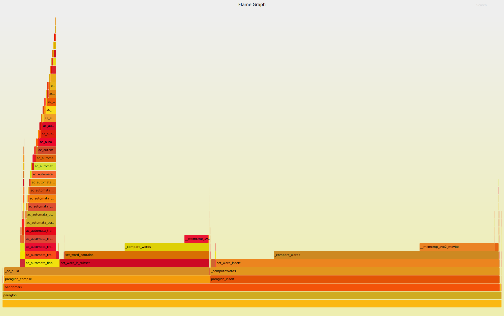

# Paraglob 2
A (hopefully) very fast way to get all values associated with keys that match a glob in a dictionary-like structure.

For example, given a map with the associations:

```
dog -> 1
fog -> 2
cat -> 3
```

Calling `myGlob.getPattern("*og");` would yield a `std::vector` containing `[1, 2]`.

This is not at all close to being done yet. <b>TODO</b> still:

  1. Migrate current implementation to C++11/17 using more `std::` features.
  2. Run speed tests.
  3. Integrate into Zeek scripting language.
  
## Pre-optimization flame graph (the starting point)


## Some performance notes on the pervious set.h and vector.h data structures
```
output from set speed test:

testing set.h 
add test..
--------
time for 0 items:
Elapsed time: 5.9748e-05 s
--------
time for 20000 items:
Elapsed time: 8.79978 s
--------
time for 40000 items:
Elapsed time: 35.7484 s
--------
time for 60000 items:
Elapsed time: 81.1556 s
--------
time for 80000 items:
Elapsed time: 145.177 s
********
TOTAL TIME: Elapsed time: 226.998 s
testing set
add test..
--------
time for 0 items:
Elapsed time: 8.853e-06 s
--------
time for 20000 items:
Elapsed time: 0.0231835 s
--------
time for 40000 items:
Elapsed time: 0.052002 s
--------
time for 60000 items:
Elapsed time: 0.0847385 s
--------
time for 80000 items:
Elapsed time: 0.11792 s
********
TOTAL TIME: Elapsed time: 0.150915 s

for inserting 100,000 items std::set is 1504 times faster than the set
were currently using. I'm not even going to bother testing this with
the other operations becasue set.h uses a linear search to look for
items when doing contains/get operations as well.


testing vector.h 
add test..
--------
time for 0 items:
Elapsed time: 5.6131e-05 s
--------
time for 20000 items:
Elapsed time: 0.0092888 s
--------
time for 40000 items:
Elapsed time: 0.0183762 s
--------
time for 60000 items:
Elapsed time: 0.0263445 s
--------
time for 80000 items:
Elapsed time: 0.0346832 s
********
TOTAL TIME: Elapsed time: 0.0422714 s
testing std::vector
add test..
--------
time for 0 items:
Elapsed time: 7.694e-06 s
--------
time for 20000 items:
Elapsed time: 0.00743331 s
--------
time for 40000 items:
Elapsed time: 0.0152959 s
--------
time for 60000 items:
Elapsed time: 0.0226912 s
--------
time for 80000 items:
Elapsed time: 0.0314793 s
********
TOTAL TIME: Elapsed time: 0.0378254 s

the vector Robin had been using is bascially as fast as std::vector.
I'll use std::vector in my implementation, but just for clarity.
```
